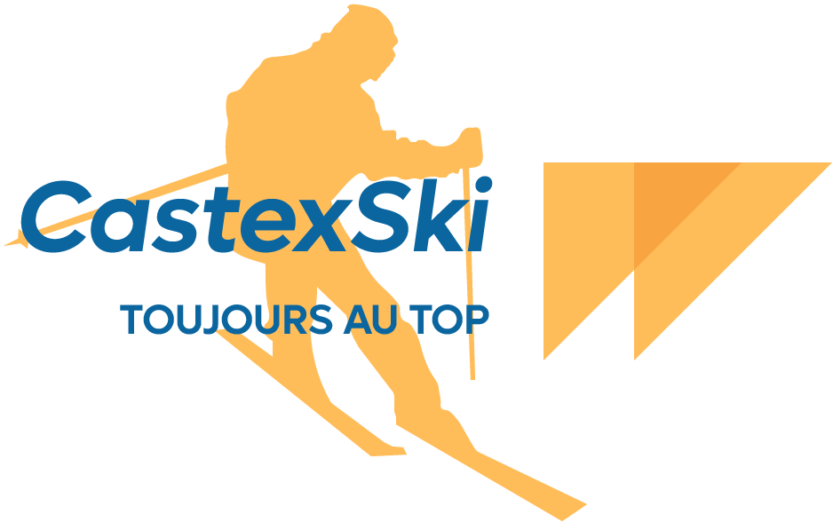

# CastexSki

Course: ISA DevOps

Supervisors: G. Molines, P. Collet, A.-M. Dery, N. Bounouas, N. Rousseau, L. Lopez, N. Strobbe, S. Dahmoul

Date: February 2021 - May 2021

## Description

CastexSki is a management system for a ski lift company. The system has to manage several ski resorts. The goal is to modernize the company's information system in order to offer more innovative services while ensuring distance guarantees during this period of health crisis. The system allows the sale of ski passes and the automatic control of access to the ski lifts. In addition, the system must manage the purchase at the cash desk, on the website, refunds, promotions, attendance statistics and notifications.

## Structure

- [client](client): The client application (Java SE, CXF).
- [server](server): The server application (Java EE, OpenEJB, OpenJPA, TomEE+).
- [external](external): The external services (C#, .NET).

## Authors

- [João Brilhante](https://github.com/JoaoBrlt)
- [Armand Fargeon](https://github.com/armandfargeon)
- [Ryana Karaki](https://github.com/RyanaKaraki)
- [Ludovic Marti](https://github.com/LudovicMarti)
- [Valentin Roccelli](https://github.com/RoccelliV)

## License

This project is licensed under the GPLv3 License - see the [LICENSE](LICENSE) file for details.
